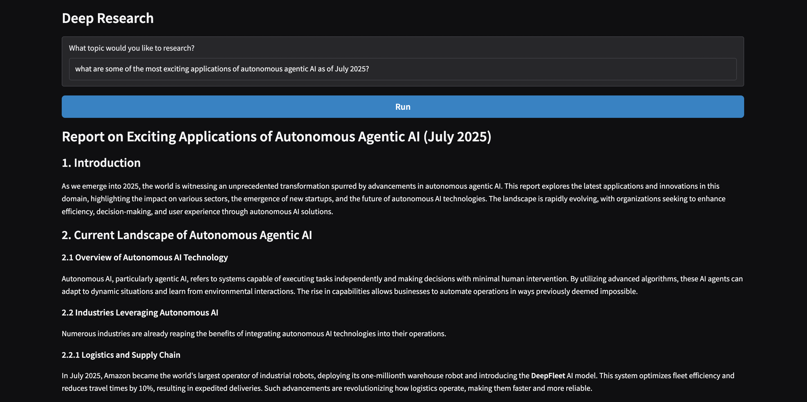
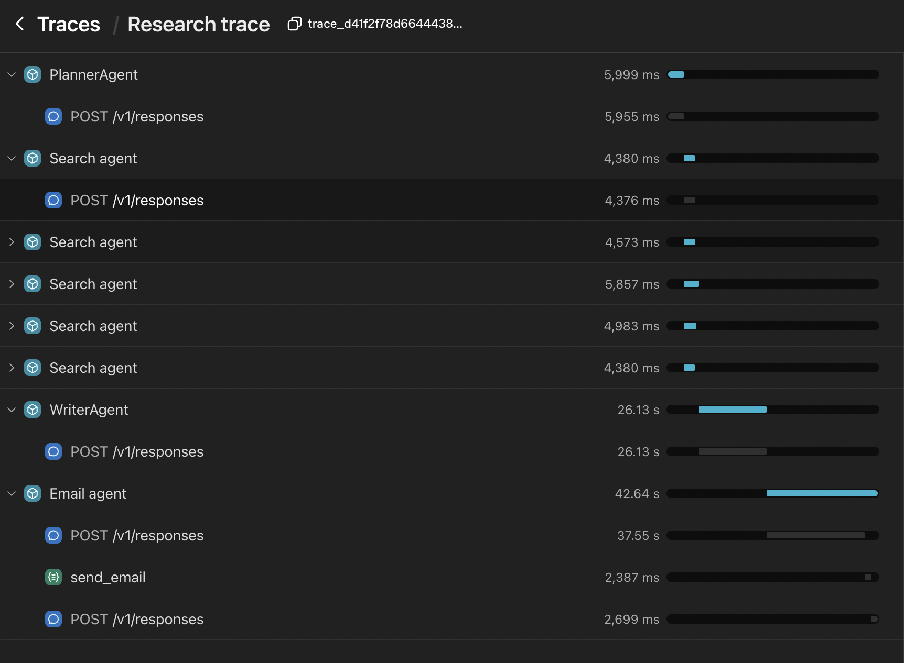

# Deep Research AI 🔬🤖

An intelligent multi-agent research system that conducts comprehensive web research and delivers detailed reports automatically. Built with OpenAI's Agents SDK, this system orchestrates multiple AI agents to plan, search, synthesize, and deliver research findings.



## 🌟 Features

- **Multi-Agent Architecture**: Coordinated team of specialized AI agents
- **Intelligent Search Planning**: Automatically generates optimal search strategies
- **Parallel Web Research**: Concurrent search execution for faster results
- **Comprehensive Reports**: Detailed 5-10 page reports with 1000+ words
- **Structured Output**: Pydantic models ensure consistent data formats
- **Email Delivery**: Automatic report distribution via SendGrid
- **Real-time Monitoring**: OpenAI tracing for complete visibility
- **Interactive Interface**: Clean Gradio web UI for easy interaction

## 🏗️ System Architecture

The system consists of five specialized AI agents working in concert:

### **🎯 Research Manager**
- Orchestrates the entire research workflow
- Manages agent coordination and data flow
- Provides real-time status updates

### **📋 Planner Agent**
- Analyzes research queries
- Generates strategic search plans
- Creates 5 targeted search queries per topic

### **🔍 Search Agent**
- Performs web searches using OpenAI's WebSearchTool
- Summarizes findings concisely (2-3 paragraphs, <300 words)
- Extracts key insights without fluff

### **✍️ Writer Agent**
- Synthesizes research into comprehensive reports
- Creates structured markdown documents
- Generates follow-up research questions

### **📧 Email Agent**
- Converts reports to HTML format
- Sends professional email reports
- Handles email formatting and delivery



## 🛠️ Tech Stack

- **AI Framework**: OpenAI Agents SDK
- **Package Manager**: UV (Python package installer)
- **Web Interface**: Gradio
- **Email Service**: SendGrid API
- **Data Models**: Pydantic for structured outputs
- **Async Processing**: Python asyncio for concurrent operations
- **Monitoring**: OpenAI Traces for execution visibility


## 🚀 Getting Started

### Prerequisites

- Python 3.8+
- UV package manager
- OpenAI API key
- SendGrid API key (for email functionality)

### Installation

1. **Clone the repository**
   ```bash
   git clone https://github.com/ShivamPatel-India/deep-research-agents.git
   cd deep-research-agents
   ```

2. **Install UV package manager**
   ```bash
   # On macOS and Linux
   curl -LsSf https://astral.sh/uv/install.sh | sh
   
   # On Windows
   powershell -c "irm https://astral.sh/uv/install.ps1 | iex"
   
   # Or with pip
   pip install uv
   ```

3. **Install dependencies**
   ```bash
   # Using UV
   uv sync
   ```

4. **Set up environment variables**
   
   Create a `.env` file in the project root:
   ```env
   OPENAI_API_KEY=your-openai-api-key-here
   SENDGRID_API_KEY=your-sendgrid-api-key-here
   ```

5. **Configure email settings**
   
   Update the email addresses in `email_agent.py`:
   ```python
   from_email = Email("your-verified-sender@domain.com")
   to_email = To("recipient@domain.com")
   ```

6. **Run the application**
   ```bash
   cd deep_research
   uv run deep_research.py
   ```

The application will launch in your browser at `http://localhost:7860`

### Example Queries

- "What are the latest developments in quantum computing as of 2024?"
- "Analyze the current state of renewable energy adoption globally"
- "What are the most promising applications of autonomous agentic AI?"
- "Compare different approaches to large language model training"

## 🔧 Configuration

### Search Configuration

Modify `HOW_MANY_SEARCHES` in `planner_agent.py` to change the number of searches:
```python
HOW_MANY_SEARCHES = 5  # Adjust as needed
```
---

**Note**: This system performs live web searches and generates comprehensive reports. Ensure you have sufficient API credits and review the generated content for accuracy before use in professional contexts.